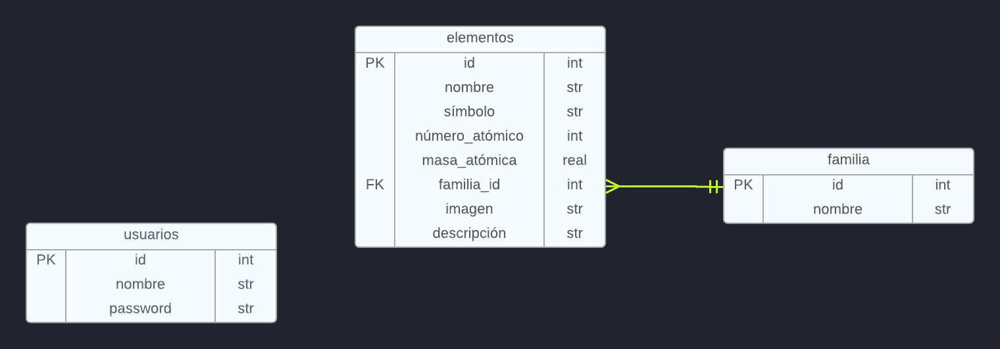
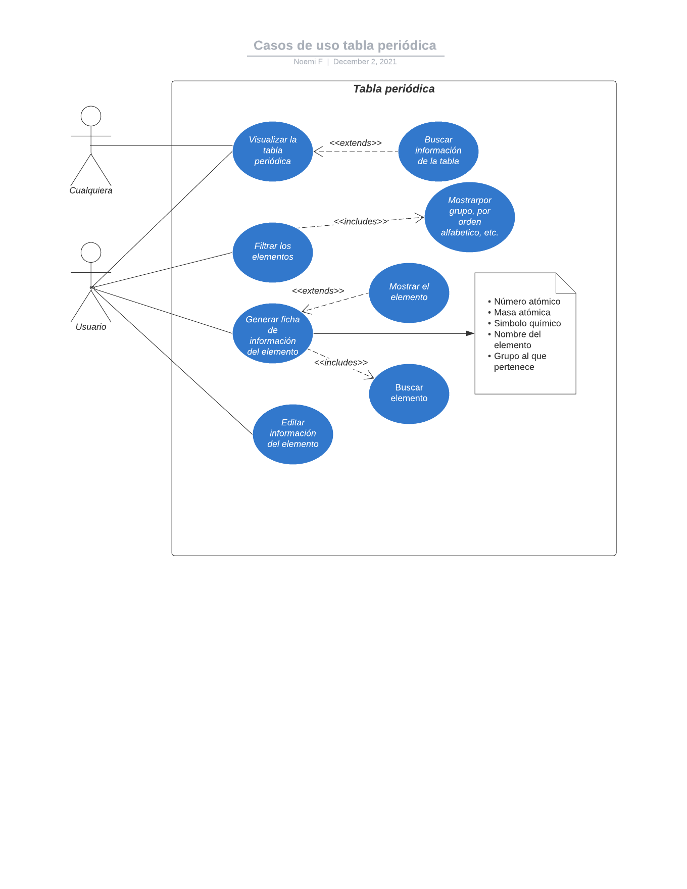

  
# Tabla periódica de los elementos interactiva

El conocimiento de una tabla periódica es indispensable en los primeros niveles educativos de cualquier persona. Sin embargo, en ocasiones suele ser tedioso y difícil de entender. 

**Es por ello que se decidió crear una tabla periódica interactiva, para facilitar el acceso a la información de cada uno de los elementos**

---
### ✅ Casos de uso
La plataforma contará con las actividades básicas tales como: buscar, ordenar según el alfabeto, por grupo, por número atómico. 

El usuario creará una cuenta en nuestra plataforma y con ello tendrá acceso a:
- Información de cada uno de los elementos existentes de la tabla: Masa atómica, número atómico, símbolo, color, grupo al que pertenece.
- El usuario podrá elegir un elemento y al seleccionarlo visualizará una imagen representativa e información adicional. 

### ❎ Casos de uso no soportados
- No podrá editar elementos de la tabla periódica
- No se tienen tablas personalizadas por usuario

---
### ⛩ Arquitectura

### Tecnologías

**Backend**

**DevOps**

### 📊 Diagramas

Diagrama Relacional

Diagrama de Casos de Uso

